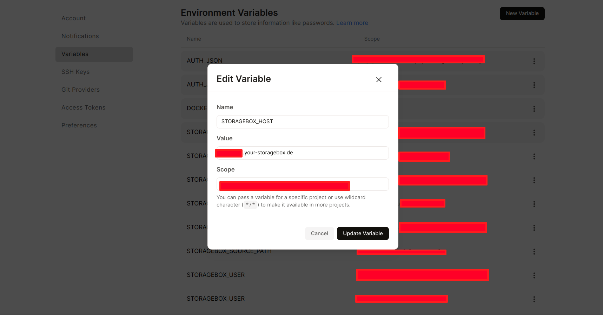
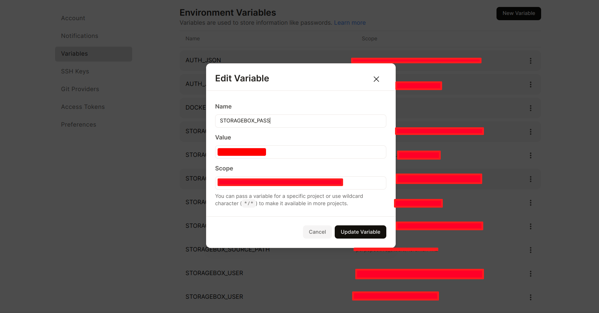
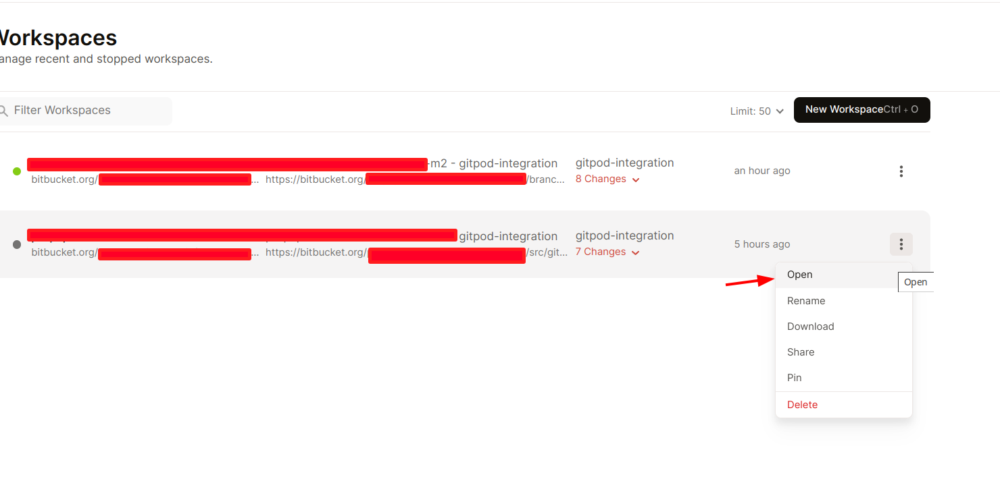

# How to start the project
## To set the Variables you have to register at [Gitpod](https://gitpod.io/login) and/or any Gitpod on-premise plus install [Gitpod Chrome extension](https://chrome.google.com/webstore/detail/dodmmooeoklaejobgleioelladacbeki)
## To deploy the project at Gitpod, you must determine several GP settings variables:


1. Click on your profile image.  
    

2. Click on the User Settings menu item  

    


3. Click on the Variables menu entry. 

    

4. Add the following Variable Name to your account. (If you need a clear magento use the [gitpod-manage-db-install.sh](.warden%2Fgitpod-manage-db-install.sh))

    

    1. Notice: DOCKERD_ARGS could be used in global scope; defined once. 
5. Examples of the Variables
    1. AUTH_JSON 

    

    2. DOCKERD_ARGS  
   ```json
    {"userns-remap":"1000"}
    ```
    

    3. STORAGEBOX_HOST 

    
   4. STORAGEBOX_USER

      

   5. STORAGEBOX_PASS 

      

   6. STORAGEBOX_SOURCE_PATH 

      

      

## To spin up the project use this button on appropriate branch

  


## To restart the workspace use the "Open" button on the Gitpod dashboard  




## To switch the websites use [COOKIE Editor extension](https://chrome.google.com/webstore/detail/hlkenndednhfkekhgcdicdfddnkalmdm)  

### Example of the COOKIE Editor extension  

1. Set XSTORE cookie to the value of the website you want to use. See the list of the websites below or in the file .warden/nginx/default.conf.template. 
    
    1.1 Set the 'base' code to load the 'base' website.  
          
    1.2. Refresh the page.
    1.3. Set the 'other_code' code to load the 'other_code' website.  
                
    1.4. Refresh the page.

